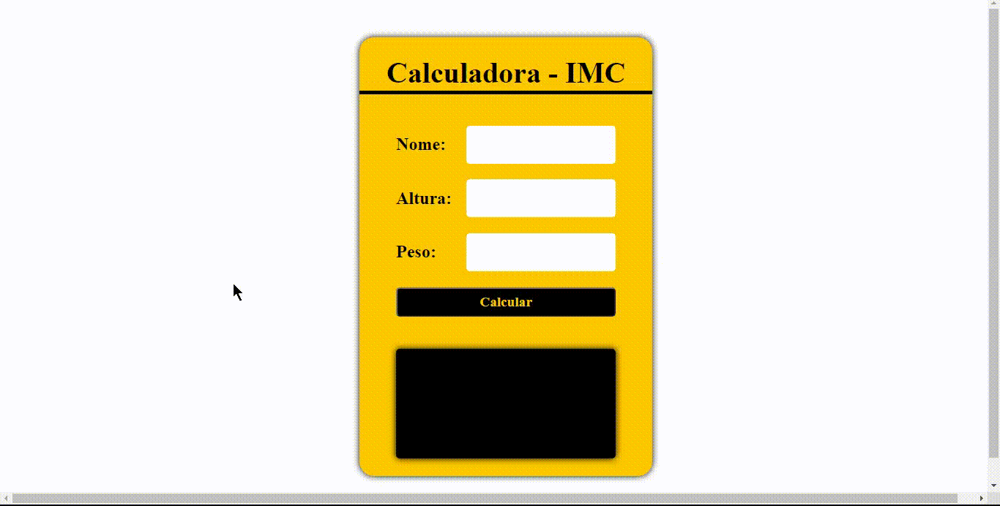

<h1 align="center">
    
</h1>

  

###  Sobre

**Calculadora IMC**: Vai calcular o seu peso e sua altura.  Ex: "Peso / (Altura x Altura)" e com esse resultado da saber sua Massa Corporal. 

---

GitHub Pages: https://aurelianoderafa.github.io/projetoIMC/

---
 
### 💻 Tecnologia utilizada

- HTML 5
- CSS 3
- JAVACRIPT

---
